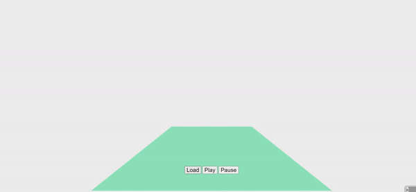

# A-Frame-Volumetric-Video-Component


### **Description / Rationale**
This is an A-Frame component for volumetric videos, which is powered by Volograms. The creation of the component was inspired from similar works of Remy Mellet <a href="https://github.com/remmel/volograms-js">Volograms.js</a>, <a href="https://github.com/remmel/aframe-volograms">A-Frame Volograms</a> and Volograms' playback library <a href="https://github.com/Volograms/vol_libs">vol_libs</a>. The latter was used as the main source for developing this component. And the main difference with Remy Mellet's A-Frame component is that this component is based on vologram web player using three.js, and the vol_geom library compiled to WASM. Also, vologram files loading speed it much higher.       

### **Instructions**
In order to use the component attach "vologram-component" to an A-frame entity. The component has the following attributes: 
* <b>headerUrl: { type: "string", default: "vologram/header.vols" }</b> - the URL/link to header.vols file as generated by Volu App of Volograms.
* <b>sequenceUrl: { type: "string", default: "vologram/sequence_0.vols" }</b> - the URL/link to sequence_0.vols file as generated by by Volu App of Volograms.
* <b>videoUrl: { type: "string", default: "vologram/texture_2048_h264.mp4" }</b> - the URL/link to video texture file as generated by by Volu App of Volograms.
* <b>vologramFps: {type: "float", default: 30.0}</b> - frames per second of the vologram file.

The code below shows the sample implementation of the component:
```
<!DOCTYPE html>
<html>
<head>
    <meta charset="UTF-8">
    <meta name="viewport" content="width=device-width, user-scalable=no, minimum-scale=1.0, maximum-scale=1.0">
    <Title>A-Frame Component: Volumetric Video</Title>
    <script src='https://aframe.io/releases/1.4.2/aframe.min.js'></script>
    <script src="js/vologram-component.js"></script>
    <style>
        #button-container {
            position: fixed;
            bottom: 0;
            width: 300px;
            left: 50%;
            transform: translateX(-50%);
            margin-bottom: 5%;
            width: 200px;
            text-align: center;
            z-index: 3;
        }
        #load-vologram,
        #play-vologram,
        #pause-vologram {
            font-size: 20px;
        }
    </style>
</head>
<body>
    <div id="button-container">
        <input type="button" id="load-vologram" value="Load">
        <input type="button" id="play-vologram" value="Play">
        <input type="button" id="pause-vologram" value="Pause">
    </div>

    <a-scene>
        <a-entity id="vologram"
            vologram-component="headerUrl: vologram/header.vols; sequenceUrl: vologram/sequence_0.vols; videoUrl: vologram/texture_2048_h264.mp4; vologramFps: 30.0"
            position="0 0 -3"></a-entity>
        <a-plane position='0 0 -4' rotation='-90 0 0' width='4' height='4' color='#7BC8A4'></a-plane>
        <a-sky color='#ECECEC'></a-sky>
    </a-scene>
</body>
</html>
```
Please note that component has three buttons which do the following: load vologram and plays video; plays vologram video; pauses vologram video.

### **Exporting Volograms from Volu app** 
<a href="https://apps.apple.com/us/app/volu-3d-volumetric-holograms/id1555245459">Volu</a> is the application by Volograms, which is only available for IOS devices at present. It is possible to generate volumetric videos of persons by using this app (it is free) and export related files (it is also free) for using in different development environments. 
In order to export own vologram, consisting of 3 files (header.vols, sequence_0.vols - sequence of meshes, texture_1024_h264.mp4 - video with texture), which are used in this component, do the following:
1. Register free acount and generate own vologram.
2. In the "Edit Vologram" menu (please note that you can only edit own vologram; example volograms do not have such an option), use "Export" button to export vologram. Make sure to save it as .zip file in the local system.
3. Download/copy .zip file to your PC and unzip it. Take resulting 3 files and put them inside vologram folder or any other place you want (make sure that the URL reflects that).
    

### **Tech Stack**
The project is powered by AFrame and Three.js. Sample vologram was taken from <a href="https://github.com/Volograms/vol_libs">vol_libs</a> repository. 

### **Demo**
See demo of the component here: [Demo](https://volumetric-vid.glitch.me/)
